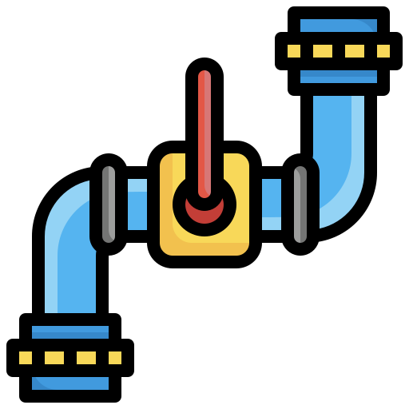

<div align="center">
  
  <h1>playlist-pipeline</h1>
  <p><strong>A CLI for programmatically organising, pruning & grooming your Spotify playlists</strong></p>
  <div>
    <a href="https://www.npmjs.com/package/playlist-pipeline">
      
    </a>
    <a href="https://github.com/mike182uk/playlist-pipeline/actions?query=workflow%3ACI">
      
    </a>
    <a href="https://www.npmjs.com/package/playlist-pipeline">
      
    </a>
    <a href="https://www.npmjs.com/package/playlist-pipeline">
      
    </a>
  </div>
</div>

## Prerequisites

- [Node.JS >=12](https://nodejs.org/en/download/)
- A paid for [Spotify account](https://www.spotify.com/uk/premium/#plans)
- A [Spotify developer account](https://developer.spotify.com/)

## Installation

You can install `playlist-pipeline` globally:

```sh
npm i -g playlist-pipeline
```

or use it directly via `npx`:

```sh
npx playlist-pipeline <command>
```

## Usage

Before you can use `playlist-pipeline` you need to have setup and configured an app in your Spotify
developer account:

1. Login to your developer account
2. Click the `CREATE AN APP` button
3. Give your app a name, description and accept Spotify's developer terms of service
4. Once your app is created, navigate to it and click the `EDIT SETTINGS` button
5. Add `http://localhost:3182` as a `Redirect URI` and save the changes
6. Make a note of the `Client ID` for the app (visible on the main page for the app)

Now that the Spotify app has been setup and configured, `playlist-pipeline` should be configured to
use the the app:

```sh
playlist-pipeline set-client-id <your-app-client-id>
```

`playlist-pipeline` has now been configured and can be used:

```sh
playlist-pipeline run <path-to-config-file>
```

If this is the first time you are executing `playlist-pipeline` you will be required to provide permission for the app you have previously created to access your account (follow the instructions on the terminal).

`playlist-pipeline` will request the following scopes:
  - `playlist-modify-public` - Needed to save changes to public playlists
  - `playlist-modify-private` - Needed to save changes to private playlists
  - `playlist-read-private` - Needed to read data from private playlists
  - `playlist-read-collaborative` - Needed to read data from collaborative playlists
  - `user-library-read` - Needed to read data from library

`playlist-pipeline` will store the access token retrieved from Spotify locally and encrypt it. To remove all data saved by `playlist-pipeline` use the `reset` command:

```sh
playlist-pipeline reset
```

### The config file

The config file represents a single pipeline and the tasks that should occur during its execution. The config file is defined using `YAML`:

```yml
name: Remove duplicate tracks

tasks:
  get_tracks:
    type: playlist.get_tracks
    spotify_url: https://open.spotify.com/playlist/<playlist_id>

  dedupe_tracks:
    type: tracks.dedupe
    tracks: get_tracks

  save_tracks:
    type: playlist.replace_tracks
    spotify_url: https://open.spotify.com/playlist/<playlist_id>
    tracks: dedupe_tracks
```

`name` and `tasks` are required properties. `name` provides context as to what the pipeline is for and `tasks` defines the actions that should be executed. 

Each task has an ID to provide context as to what the task is doing, and to later reference any data that is returned from the task. Different properties will be available to configure the task depeding on its `type`.

In the above example the first task has the ID `get_tracks`. It's `type` is `playlist.get_tracks` which means it is going to retrieve tracks from a playlist. `spotify_url` defines where the task will retrieve the tracks from.

The next task in the pipeline has the ID `dedupe_tracks`. It's `type` is `tracks.dedupe` which means it is going to remove duplicates from a collection of tracks. `tracks` defines which collection of tracks to remove duplicates from. The value for this should be the ID of a task that has already been executed that returns a collection tracks. In this example the tracks retreived during the `get_tracks` task will be used.

The final task in the pipeline has the ID `save_tracks`. It's `type` is `playlist.replace_tracks` which means it is going to replace all of the tracks in a playlist with the tracks in a specified collection of tracks. `spotify_url` defines which playlist will have its tracks replaced. `tracks` defines which collection of tracks to use to replace the tracks in the playlist. The value for this should be the ID of a task that returns a collection tracks. In this example the tracks de-duplicated during the `dedupe_tracks` task will be used.

A pipeline can contain an unlimited number of tasks and each task will be executed sequentially. If an error occurs during the execution of a task, any tasks after will not be executed.

### Task types

- [`playlist.get_tracks`](#playlistget_tracks)
- [`album.get_tracks`](#albumget_tracks)
- [`library.get_tracks`](#libraryget_tracks)
- [`tracks.dedupe`](#tracksdedupe)
- [`tracks.merge`](#tracksmerge)
- [`tracks.sort`](#trackssort)
- [`tracks.shuffle`](#tracksshuffle)
- [`tracks.filter`](#tracksfilter)
- [`playlist.replace_tracks`](#playlistreplace_tracks)
- [`tracks.export`](#export)
- [`playlist.update_details`](#playlistupdate_details)

#### `playlist.get_tracks`

Retrieve tracks from a playlist

```yml
<task_id>:
  type: playlist.get_tracks
  spotify_url: https://open.spotify.com/playlist/<playlist_id>
```

- `spotify_url` - Spotify URL for playlist

---

#### `album.get_tracks`

Retrieve tracks from an album

```yml
<task_id>:
  type: album.get_tracks
  spotify_url: https://open.spotify.com/album/<album_id>
```

- `spotify_url` - Spotify URL for album

---

#### `library.get_tracks`

Retrieve tracks from the authenticated users library (saved / liked tracks)

```yml
<task_id>:
  type: library.get_tracks
```

---

#### `tracks.dedupe`

Remove duplicate tracks from a track collection

```yml
<task_id>:
  type: tracks.dedupe
  tracks: <id_of_task_returning_a_track_collection>
```

- `tracks` - ID of a task that returns a track collection

---

#### `tracks.merge`

Merge multiple track collections into one collection

```yml
<task_id>:
  type: tracks.merge
  tracks: 
    - <id_of_task_returning_a_track_collection>
    - <id_of_task_returning_a_track_collection>
    - <id_of_task_returning_a_track_collection>
```

- `tracks` - IDs of tasks that return a track collection. There is no limit to the number of track collections that can be merged together

---

#### `tracks.sort`

Sort tracks in a track collection by a specified field(s)

```yml
<task_id>:
  type: tracks.sort
  tracks: <id_of_task_returning_a_track_collection>
  sort:
    <field>: <direction>
```

- `tracks` - ID of a task that returns a track collection
- `sort` - The field(s) to sort by and the direction
  - Valid fields are:
    - `album` - Album name
    - `artist` - Artist name
    - `name` - Track name
    - `releaseDate` - Track release date
    - `releaseYear` - Track release year
    - `trackNumber` - Track number
    - `popularity` - Track popularity (out of 100)
    - `duration` - Track duration (in milliseconds)
  - Valid directions are `asc` (`ascending`, `A-Z`, `0-9`) and `desc` (`descending`, `Z-A`, `9-0`).

Multiple fields can be used to sort:

```yml
# Sort by artist name ascending and release date descending

<task_id>:
  type: tracks.sort
  tracks: <id_of_task_returning_a_track_collection>
  sort:
    artist: asc
    releaseDate: desc
```

##### Group sorting

If you have more advanced sorting needs, you can group tracks together before sorting them, then sort by the groups themselves:

```yml
<task_id>:
  type: tracks.sort
  tracks: <id_of_task_returning_a_track_collection>
  group_by: <field>
  sort:
    <field>: <direction>
  sort_group:
    <field>: <direction>
```

- `tracks` - ID of a task that returns a track collection
- `group_by` - The field to group tracks together by
  - `album` - Album name
  - `albumId` - Album ID
  - `albumUri` - Album URI
  - `artist` - Artist name
  - `artistId` - Artist ID
  - `artistUri` - Artist URI
  - `name` - Track name
  - `releaseDate` - Track release date
  - `releaseYear` - Track release year
  - `trackNumber` - Track number
  - `popularity` - Track popularity (out of 100)
  - `duration` - Track duration (in milliseconds)
- `sort` - The field(s) to sort the tracks by and the direction
  - Valid fields are:
    - `album` - Album name
    - `artist` - Artist name
    - `name` - Track name
    - `releaseDate` - Track release date
    - `releaseYear` - Track release year
    - `trackNumber` - Track number
    - `popularity` - Track popularity (out of 100)
    - `duration` - Track duration (in milliseconds)
  - Valid directions are `asc` (`ascending`, `A-Z`, `0-9`) and `desc` (`descending`, `Z-A`, `9-0`).
- `sort_group` - The field(s) to sort the groups by and the direction
  - Valid fields are:
    - `album` - Album name
    - `artist` - Artist name
    - `name` - Track name
    - `releaseDate` - Track release date
    - `releaseYear` - Track release year
    - `trackNumber` - Track number
    - `popularity` - Track popularity (out of 100)
    - `duration` - Track duration (in milliseconds)
  - Valid directions are `asc` (`ascending`, `A-Z`, `0-9`) and `desc` (`descending`, `Z-A`, `9-0`).

**The first track of each group is used to sort the groups.**

```yml
# Group tracks by album, sort tracks by track number ascending, sort groups by release date ascending 

<task_id>:
  type: tracks.filter
  tracks: <id_of_task_returning_a_track_collection>
  group_by: album
  sort:
    trackNumber: asc
  sort_groups:
    releaseDate: asc
```

---

#### `tracks.shuffle`

Randomly shuffle the tracks in a track collection

```yml
<task_id>:
  type: tracks.shuffle
  tracks: <id_of_task_returning_a_track_collection>
```

- `tracks` - ID of a task that returns a track collection

---

#### `tracks.filter`

Filter tracks in a track collection by a specified field(s)

```yml
<task_id>:
  type: tracks.filter
  tracks: <id_of_task_returning_a_track_collection>
  filter:
    <field>:
      operator: <filter_operator>
      value: <filter_value>
```

- `tracks` - ID of a task that returns a track collection
- `filter` - The field(s) to filter by and what operator & value to use
  - Valid fields are:
    - `album` - Album name (`string`)
    - `artist` - Artist name (`string`)
    - `name` - Track name (`string`)
    - `trackNumber` - Track number (`number`)
    - `genre` - Artist genre (`string`)
    - `explicit` - Track explicitness (`boolean`)
    - `popularity` - Track popularity (out of 100) (`number`)
    - `duration` - Track duration (in milliseconds) (`number`)
    - `releaseDate` - Track release date (`date`)
    - `releaseYear` - Track release year (`number`)
  - Valid operators are:
    - `eq` - Equal to
    - `neq` - Not equal to
    - `gt` - Greater than
    - `gte` - Greater than or equal to
    - `lt` - Less than
    - `lte` - Less than or equal to
  - Different fields allow different operators:
    - `album` - `eq`, `neq`
    - `artist` - `eq`, `neq`
    - `name` - `eq`, `neq`
    - `trackNumber` - `eq`, `neq`, `gt`, `gte`, `lt`, `lte`
    - `genre` - `eq`, `neq`
    - `explicit` - `eq`, `neq`
    - `popularity` - `eq`, `neq`, `gt`, `gte`, `lt`, `lte`
    - `duration`  - `eq`, `neq`, `gt`, `gte`, `lt`, `lte`
    - `releaseDate`  - `gt`, `lt`
    - `releaseYear` - `eq`, `neq`, `gt`, `gte`, `lt`, `lte`

```yml
# Filter tracks that are less than 3 minutes

<task_id>:
  type: tracks.filter
  tracks: <id_of_task_returning_a_track_collection>
  filter:
    duration:
      operator: lt
      value: 180000
```

```yml
# Filter tracks that are non explicit and by blink-182 

<task_id>:
  type: tracks.filter
  tracks: <id_of_task_returning_a_track_collection>
  filter:
    artist:
      operator: eq
      value: blink-182
    explicit:
      operator: eq
      value: false
```

```yml
# Filter tracks that are not pop and were released before 2021

<task_id>:
  type: tracks.filter
  tracks: <id_of_task_returning_a_track_collection>
  filter:
    releaseDate:
      operator: lt
      value: 2021
    genre:
      operator: neq
      value: pop
```

When there are multiple fields in the filter the tracks in the track collection will be filtered by all of them (i.e field `x` is `y` **AND** field `z` is `a`). You can also filter by multiple sets of filters which act as an `OR` (field `x` is `y` **OR** field `x` is `z`):

```yml
# Filter tracks that are either by blink-182 or box car racer

<task_id>:
  type: tracks.filter
  tracks: <id_of_task_returning_a_track_collection>
  filter:
    - artist:
        operator: eq
        value: blink-182
    - artist:
        operator: eq
        value: box car racer
```

```yml
# Filter tracks that are either by blink-182 and released after 2003 or by box car racer and released after 2003

<task_id>:
  type: tracks.filter
  tracks: <id_of_task_returning_a_track_collection>
  filter:
    - releaseDate:
        operator: gt
        value: 2003
      artist:
        operator: eq
        value: blink-182
    - releaseDate:
        operator: gt
        value: 2003
      artist:
        operator: eq
        value: box car racer
```

You can also filter based on multiple conditions per field (this acts as an **AND** not an **OR**):

```yml
# Filter tracks that were released 2003 - 2006

<task_id>:
  type: tracks.filter
  tracks: <id_of_task_returning_a_track_collection>
  filter:
    releaseYear:
      - operator: gte
        value: 2003
      - operator: lte
        value: 2006
```

##### Shorthand filters 

A shorthand syntax is also supported so that you do not have to explicitly define the `operator` and `value` of a filter:

```yml
<task_id>:
  type: tracks.filter
  tracks: <id_of_task_returning_a_track_collection>
  filter:
    artist: blink-182
```

This is the same as:

```yml
<task_id>:
  type: tracks.filter
  tracks: <id_of_task_returning_a_track_collection>
  filter:
    artist:
      operator: eq
      value: blink 182
```

A few examples:

```yml
# Filter tracks that are by blink-182

<task_id>:
  type: tracks.filter
  tracks: <id_of_task_returning_a_track_collection>
  filter:
    artist: blink-182
```

```yml
# Filter tracks that are not by blink-182

<task_id>:
  type: tracks.filter
  tracks: <id_of_task_returning_a_track_collection>
  filter:
    artist: '!blink-182'
```

```yml
# Filter tracks that are longer than 3 minutes

<task_id>:
  type: tracks.filter
  tracks: <id_of_task_returning_a_track_collection>
  filter:
    duration: '>180000'
```

```yml
# Filter tracks that were released before 2008

<task_id>:
  type: tracks.filter
  tracks: <id_of_task_returning_a_track_collection>
  filter:
    track: '<2008'
```

```yml
# Filter tracks that are explicit

<task_id>:
  type: tracks.filter
  tracks: <id_of_task_returning_a_track_collection>
  filter:
    explicit: true
```

```yml
# Filter tracks that are more popular than 69/100

<task_id>:
  type: tracks.filter
  tracks: <id_of_task_returning_a_track_collection>
  filter:
    popularity: ">=70"
```

```yml
# Filter tracks that were released 2003 - 2006

<task_id>:
  type: tracks.filter
  tracks: <id_of_task_returning_a_track_collection>
  filter:
    releaseDate: 
      - ">= 2003"
      - "<= 2006"
```

Quotes (`"` or `'`) are needed around a value that contains an operator ( `!`, `<`, `>`, `>=`, `<=`)

Both syntaxes are supported interchangeably.

Shorthand Opertators:
  - `=` (or no operator at all) - Equal to
  - `!` - Not equal to
  - `>` - Greater than
  - `>=` - Greater than or equal to
  - `<` - Less than
  - `<=` - Less than or equal to

---

#### `playlist.replace_tracks`

Replace the tracks in a playlist with tracks from a track collection

```yml
<task_id>:
  type: playlist.replace_tracks
  spotify_url: https://open.spotify.com/playlist/<playlist_id>
  tracks: <id_of_task_returning_a_track_collection>
```

- `spotify_url` - Spotify URL for playlist
- `tracks` - ID of a task that returns a track collection

---

#### `tracks.export`

Export the tracks in a track collection to a file

```yml
<task_id>:
  type: tracks.export
  tracks: <id_of_task_returning_a_track_collection>
  format: <format>
  fields: 
    - <field>
  filename: <name_of_file_to_export_tracks_to>
```

- `tracks` - ID of a task that returns a track collection
- `format` - The format to use for the export data
  - Valid formats are:
    - `json`
- `fields` - The fields to include in the export data
  - Valid fields are:
    - `id` - Track ID
    - `name` - Track name
    - `trackNumber` - Track number
    - `album` - Album name
    - `albumId` - Album ID
    - `albumUri` - Album URI
    - `releaseDate` - Track release date
    - `releaseYear` - Track release year
    - `artist` - Artist name
    - `artistId` - Artist ID
    - `artistUri` - Artist URI
    - `uri` - Track URI
    - `genre` - Artist genre
    - `popularity` - Track popularity (out of 100)
    - `duration` - Track duration (in milliseconds)
    - `explicit` - Track explicitness
- `filename` - The name of the file to export to (without extension)

---

#### `playlist.update_details`

Update the details of a playlist

```yml
<task_id>:
  type: playlist.update_details
  spotify_url: https://open.spotify.com/playlist/<playlist_id>
  name: <name>
  description: <description>
```

- `spotify_url` - Spotify URL for playlist
- `name` - Name of playlist
- `description` - Description for playlist

You can include the current date in the description using the `date` tag:

```yml
<task_id>:
  type: playlist.update_details
  spotify_url: https://open.spotify.com/playlist/<playlist_id>
  description: 'Last Updated: {{ date "dd MMMM Y" }}'
```

`{{ date "dd MMMM Y" }}` will be replaced with the current date using the provided format. See [here](https://date-fns.org/v2.25.0/docs/format) for details on how to format the date.

---

**See the [examples](examples) directory for further config file examples.**

## Advanced Usage

Here be dragons 🐉

### Debugging

If you want to see what `playlist-pipeline` is doing under the hood when executing a pipeline, pass the debug option (`-d`) when executing a command:

```sh
playlist-pipeline run -d <path-to-config-file>
```

### Using `stdin` instead of a config file

`playlist-pipeline` supports reading config from `stdin`. The config must be defined using `JSON` when providing in this way (under the hood, `playlist-pipeline` converts a `YAML` config file to `JSON`)

```sh
echo '{"name":"foo bar baz","tasks":{}}' | playlist-pipeline run
```

This is useful if you are dynamically generating config.

See the [examples/stdin](examples/stdin) directory for examples.

### Using your own access token

You can provide your own access token by passing the token option (`-t`) when executing the run command:

```sh
playlist-pipeline run -t '<your-access-token>' <path-to-config-file>
```

When using your own access token, no token refereshing happens - when your token expires you will need to provide a refereshed access token.

This is useful if you are handling authentication externally to `playlist-pipeline`.

#### Obtaining your own access token

You will have needed to have given `playlist-pipeline` permission to access your account before you can obtain an access token manually. Once you have done this you can follow the guides here to retrieve an access token:

https://developer.spotify.com/documentation/general/guides/authorization-guide/

## FAQS

### How does `playlist-pipeline` authenticate with Spotify?

[Authorization Code Flow with Proof Key for Code Exchange (PKCE)](https://developer.spotify.com/documentation/general/guides/authorization-guide/#authorization-code-flow-with-proof-key-for-code-exchange-pkce). This method is used so that the acquired access token can be refereshed when it has expired, without the need to provide the client secret.

---

_Icon made by [surang](https://www.flaticon.com/authors/surang) from [Flaticon](https://www.flaticon.com)_
